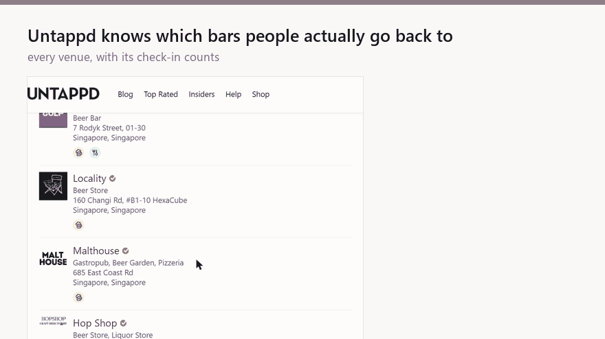

# beer in this town

[](https://github.com/Odiph/beer-in-this-town/actions/workflows/ci.yml)

[](LICENSE)

**Find out where to get a beer in this town — then put it on your map.**



Reads Untappd's public venue listings for a city, collects each venue's
**Venue Stats** (total / unique / monthly check-ins), and exports a CSV plus a
map file you can import into Google My Maps, Organic Maps or OsmAnd.

Designed to be **driven by a coding agent**: every command speaks JSON, reports
its own state, and tells you what to run next. It works fine as a plain CLI too.

`run --no-upload` reads public pages, writes files to `data/` and touches no
account of yours — and with `--format gpx` you get pins on your everyday map
without a Google account being involved at all.

Note the flag: **`run` uploads to Google My Maps by default**, which drives a
real Chrome session on your Google profile and creates a new map each time.
That is a supported bulk import rather than anything Google's terms object to,
but it is not nothing, so pass `--no-upload` if you only want the files. The
two commands that write into a saved *list* — `pin` and `notes` — are separate,
opt-in, never run on their own, and spelled out in
[Where the lines are](#where-the-lines-are).

```bash
beertown status --json      # where am I, what is next
beertown run --query singapore --count 100 --json
```

---

## Why this exists

Untappd knows which bars in a city are actually worth going to. Thousands of
check-ins per venue, updated constantly, and nobody checks into a bad taproom
twice.

Google Maps is where you actually decide where to walk tonight.

Nothing connects the two. So the data that answers *"where should I drink
here?"* lives in one app, the map you navigate with lives in another, and
moving a hundred venues across by hand is an evening you could have spent in
one of them.

This closes that gap. Point it at a city and you get every venue with its
check-in counts, landed on your own map — as a bulk-imported layer, or pinned
into a real saved list with the numbers written into each place's note, so the
map itself tells you which of the four bars on this street is the one people
keep going back to.

Useful for planning a trip, working out a city you have just moved to, spotting
which places are getting busy this month, or keeping a list worth sharing of
somewhere you already know well.

It runs in about six minutes for a hundred venues, and it is built to be
**boringly trustworthy**: it verifies every write, paces itself so it will not
get your account flagged, and refuses to emit data it is not confident in
rather than quietly handing you wrong numbers.

Along the way it turned out that Google Maps has **no legitimate way to bulk-add
places to a saved list** — no API surface, no OAuth scope, no URL parameter, no
intent. [Here is the full research](#there-is-no-api-for-this-we-checked), with
the workarounds ranked.

## Prerequisites

| | Required for | Notes |
|---|---|---|
| **Python 3.11 or 3.12** | everything | CI tests both, on Linux and Windows. |
| **Google Chrome or Chromium** | `bootstrap`, `pin`, `notes` | Found automatically on `PATH`, or at the standard Windows / macOS / Linux install paths. `run` reads over plain HTTP, and falls back to driving Chrome when Untappd renders results client-side. |
| **An Untappd account** | optional | Everything public works signed out; without a session the **YOU** column is empty and `bootstrap` warns you. |
| **A Google account** | `pin`, `notes` only | You also create the saved list by hand first — these commands never create one. |

Linux and Windows are covered by CI. macOS is not tested, though Chrome
discovery handles it.

No API keys are needed. Geocoding defaults to Nominatim (free, throttled to
1 request/second by OpenStreetMap's policy); two optional environment variables
change that:

| Variable | Effect |
|---|---|
| `GOOGLE_GEOCODING_KEY` | Use Google's geocoder instead of Nominatim — faster, and no 1 req/s ceiling. Addresses are then sent to Google; see [SECURITY.md](SECURITY.md). |
| `NOMINATIM_EMAIL` | Sent as the contact address OSM's usage policy asks for. Unset, requests identify as `no-contact-set`. |
| `GOOGLE_PLACES_KEY` | Enables the closure check (`closures`, `run --check-closed`). Separate from the geocoding key on purpose — see [SECURITY.md](SECURITY.md). |

### Is this place still open?

Untappd's venue database is append-only in practice, so a bar that shut in
2019 keeps its page, its check-in history and its stats — and since `run`
ranks on those stats, a long-dead venue outranks a good one that opened last
year. For trip planning that is the failure you find out about on the
pavement.

```bash
beertown closures --csv data/venues_london_2026-09-20.csv --limit 3 --json
beertown closures --csv data/venues_london_2026-09-20.csv --json
```

That asks the Google Places API for each venue's `businessStatus` and writes
a `business_status` column into a **new** CSV (`data/checked_<name>.csv`) —
the input is never overwritten. `run --check-closed` does the same thing
inline, and is off by default.

Two things worth knowing before you rely on it:

- **Closed venues are flagged, not removed.** Nothing downstream drops them.
  What to do about a venue Google calls shut is your call, and `run` uploads
  to My Maps, so a silent deletion would be invisible.
- **A venue Places cannot find is recorded as `unmatched`, never as closed.**
  A failed lookup means the place closed, was renamed, is too new, or Places
  simply lacks it — four cases wanting opposite outcomes, so none is picked.
  The cost is that a venue which quietly shut and was delisted survives as
  unknown. That is the better trade: a false closure deletes a real bar from
  your map.

Cost: `businessStatus` is a Pro field on Text Search, so this bills the
Places API Text Search Pro SKU — 5,000 lookups a month free, then $25.60 per
1,000. Results are cached in `state/`, so re-running costs nothing for venues
already resolved. At a hundred venues a week you will not leave the free
tier, but billing must be enabled on the key.

## Start here

```bash
beertown
```

That's it. With no arguments it opens a dashboard on `localhost` that walks you through the one-time setup:
Chrome, your Google account, your Untappd account. It signs you in, then
**tests both accounts with a real round-trip** — and only calls them connected
once that passes.

(`beertown ui` does the same thing explicitly. A bare `beertown` stays out of the way when it would be unhelpful: with `--json`, or when output is piped, you get the normal error envelope rather than a server that blocks forever.)

That distinction is the point. A cookie on disk means a login happened once,
not that the account works now. Before this, a stale Untappd session announced
itself as `search_login_required` a hundred requests into a run; the dashboard
finds it in one.

While anything is running, the page narrates what it's doing and why it's
taking as long as it is — including the pacing waits, which are deliberate.

The dashboard **cannot write to your Google account**. `pin` and `notes` have
no button there and no route on that server. It binds to `127.0.0.1` only and
needs the key from the URL the terminal prints; [SECURITY.md](SECURITY.md)
explains why a local server that can capture a session needs that much care.

## Install

```bash
git clone https://github.com/Odiph/beer-in-this-town.git
cd beer-in-this-town

python -m venv .venv
source .venv/bin/activate         # Windows: .venv\Scripts\Activate.ps1
python -m pip install -e ".[dev,browser]"
playwright install chromium       # only if no system Chrome was found

beertown doctor                   # confirms deps, session and geocoder
beertown bootstrap                # one-time: log in to Untappd (and Google)
```

That installs the package in editable mode and puts `beertown` on your `PATH`.
`python -m beer_in_this_town <command>` is equivalent everywhere, and works
without installing at all if you would rather just `pip install -r
requirements.txt`.

`bootstrap` uses a **dedicated** Chrome profile, not your everyday one —
pointing Playwright at a live profile requires Chrome to be fully closed and
can disturb its session.

### Upgrading

```bash
git pull
python -m pip install -e ".[dev,browser]"   # picks up dependency changes
```

Your session, journals and rate ledger live in `state/`, `data/` and
`storage_state.json`, none of which are touched by an upgrade.

## Use

```bash
beertown doctor --json      # deps, session, geocoder
beertown selfcheck --json   # 2 requests: are the selectors alive
beertown run --query singapore --count 100 --no-upload --json
```

Outputs land in `data/`:

| File | What |
|---|---|
| `venues_<query>_<date>.csv` | full dataset |
| `venues_<query>_<date>.kml` | import this into Google My Maps |
| `venues_<query>_<date>.geojson` | `--format geojson` — Organic Maps, OsmAnd, anything OSM-based |
| `venues_<query>_<date>.gpx` | `--format gpx` — the same, lowest common denominator |
| `new_venues_<date>.csv` | only venues absent from the previous run |

## Getting it onto Google Maps

This is the part everyone gets wrong, so it is worth being precise.

**There are two different things called "a map" in Google Maps:**

| | My Maps layer | Saved list |
|---|---|---|
| Lives under | Saved → **Maps** | Saved → **Lists** |
| Pins on your everyday map | No — you open the layer | **Yes** |
| Tap a pin | Info window with imported data | Full place card, one-tap directions |
| Bulk import | **Yes — supported feature** | **No mechanism exists** |

`run` produces a KML for the **My Maps** path. That is a documented, supported
bulk import: one file, up to 2000 placemarks, done.

### There is no API for this (we checked)

We researched this properly. As of August 2026:

- **No Maps Platform API** has any write surface for user saved places. The
  catalogue is business/place data, not account data.
- **The Data Portability API** (DMA) covers Maps starred places — but every
  Maps scope is export-only. There is no import counterpart.
- **No documented URL parameter or Android intent** saves or bookmarks a place.
  Maps URLs support exactly four actions: search, directions, display, Street
  View.
- **No OAuth scope** exists that grants saved-list write, so no third-party
  service can legitimately offer it either.
- Google knows: [issue 453378725](https://issuetracker.google.com/issues/453378725)
  ("Bulk Save to Google Maps Lists", filed Oct 2025) is open and unanswered.

**The legitimate alternatives, ranked:**

0. **Skip Google.** Organic Maps and OsmAnd import GPX or GeoJSON as bookmarks
   that render on your **everyday map** — offline, no account, no OAuth, and
   nothing in their terms against it. This is the only option that is both
   fully supported *and* gives you the everyday-map pins, which is what the
   whole exercise is for. `--format gpx` or `--format geojson`.

1. **Import the KML into My Maps.** Supported, instant, keeps the check-in
   stats on each pin. You give up the everyday-map pins.
2. **Build the list once by hand on Android**, then use Maps' documented
   [multi-select](https://support.google.com/maps/answer/3184808?co=GENIE.Platform%3DAndroid)
   ("touch and hold a place, tick the others, Select all") to move them into a
   named list in one action — then **share the list**. Anyone you share with
   gets all 100 in a single tap by following it. ~40 minutes, once, and
   unambiguously clean.
3. **Follow an existing public list**, if one covers your places. One tap — but
   it isn't your data and the owner can delete it.

Saved lists cap at **3000 entries**.

### The `pin` command

The repo ships a `pin` command that drives the Google Maps UI to build a real
saved list. It exists because the gap is real and some people will want it
anyway — but it is the one part of this project that crosses a line, and
[Where the lines are](#where-the-lines-are) says exactly which.

If you use it: it verifies every save by reloading the place page, undoes
wrong-list saves, paces itself at 8–16s, and journals progress so it resumes
after an interruption. It never creates a list — you make that by hand.

## Adding the stats to a saved list

A saved list is just pins — it carries no data of its own, which makes it
strictly less informative than the KML layer where the stats show in each pin.
The one place per-venue data can live is the note attached to a saved place:

```powershell
beertown notes --csv data\venues_singapore_2026-08-21.csv `
    --list "Singapore Bars"
```

Each note reads:

```
Untappd #45 | 2,628 check-ins | 807 unique | 10/month | as of 2026-08-20
```

The date tracks **when the data was captured**, not when the note was written,
so re-running does not rewrite every note with a new date. A note that already
matches is skipped.

## Checking the venue filters

Untappd's listings include things you probably do not want on a beer map: a
café someone logged a bottle in, a bar that closed in 2019 but kept its
check-in history, occasionally somebody's flat.

Judging those needs thresholds, and a threshold nobody has checked is a guess
with a number attached. So the rules live in `classify.py`, they are **not**
applied to your data, and two commands exist to find out how right they are
before they ever are:

```bash
beertown label --csv data/venues_singapore_2026-09-20.csv --json
# fill in the two columns, then:
beertown score --labels data/labels_venues_singapore_2026-09-20.csv --json
```

`label` samples a fixed quota from each bucket rather than sampling at random,
because the cases worth measuring are the rare ones — a random hundred rows
would contain two or three of them. `score` divides that back out, so the rates
it reports still describe the whole dataset.

It reports the two kinds of mistake separately, because they do not cost the
same: a private address kept on the map is a different problem from one good
bar dropped that you add back from a visible list. Both come with the actual
rows attached, grouped, so you can read the failures rather than count them.

About 125 rows, two questions each, once.

## Where the lines are

This project touches two services that both say no to some of it. Rather than
scatter that across a dozen paragraphs, here it is in one place.

| Surface | Status |
|---|---|
| Reading Untappd venue pages (`run`, `selfcheck`) | **Against Untappd's ToS**, which prohibits automated access. |
| KML → Google My Maps (`run`) | **Supported.** A documented bulk-import feature. No line crossed. |
| Driving the Maps UI (`pin`, `notes`) | **Against Google's ToS** — "do not access the Services through automated means". |
| GPX / GeoJSON → Organic Maps, OsmAnd (`run`) | **Supported.** A documented import, on your everyday map, with no account involved. |

**On the Untappd side**, the pacing is a mitigation, not an exemption: one
connection, no concurrency, a 12h cache so a re-run costs nothing, and a
`robots.txt` check that refuses to start if the paths are disallowed. It stays
far below what a browsing human would generate. That reduces the chance of
causing anyone a problem. It does not make it permitted.

**On the Google side**, the distinction matters more than it looks. The KML
import is a feature Google built for this; `pin` and `notes` automate a UI
Google's terms say not to automate, and they exist only because
[no API for this exists](#there-is-no-api-for-this-we-checked). They are
opt-in, never run as part of `run`, and never create a list — you make that by
hand. The realistic failure mode there is not a crash but a **ban**, which is
why the guardrails around them fail closed and why agents are instructed not
to run them without an explicit human request.

If none of that sits right, the project is still useful with the writing half
untouched: `run` reads, exports, and leaves your accounts alone.

This project is not affiliated with Untappd or Google, and none of the above is
legal advice. You are responsible for your own use of it.

## Commands

| Command | What it does | Touches your account |
|---|---|---|
| `status` | Where the pipeline is, what to run next | no |
| `doctor` | Dependencies, session, geocoder | no |
| `bootstrap` | One-time login (opens a real Chrome) | reads |
| `selfcheck` | Two requests: are the venue *and search* selectors alive | no |
| `ui` | Setup dashboard: connect and test your accounts | reads |
| `run` | Collect → CSV + map files + diff | no |
| `closures` | Ask Google Places whether each venue still trades | no |
| `pin` | Save into a Google Maps list | **writes** |
| `notes` | Write stats into each place's note | **writes** |
| `label` | Emit a sample to check the venue filters by hand | no |
| `score` | Report how accurate those filters actually are | no |

## Agent-driven use

Every command emits exactly one envelope on stdout:

```json
{
  "command": "run",
  "ok": true,
  "schema_version": "1.0",
  "data": { "venues": 100, "csv": "...", "kml": "..." },
  "warnings": ["4 venue(s) have no coordinates and are not pinned"],
  "next_actions": ["python -m beer_in_this_town pin --csv \"...\" --limit 3 --json"],
  "error": null
}
```

`next_actions` holds **literal runnable commands**, best first — not hints. So
the loop is: run `status --json`, execute the first entry, repeat. A failure
returns the same shape with `ok: false` and an `error` carrying a
machine-readable `code` and a `remedy`, so there is no traceback to parse and
no exit code to interpret. Treat a change in `schema_version` as breaking.

See **[AGENTS.md](AGENTS.md)** for the error codes and the rules agents are
expected to follow, and `.claude/skills/beer-in-this-town/SKILL.md` for the
Claude Code skill.

## Politeness and failing loudly

Single connection, no concurrency, 2.0–4.5s jittered delay, 600 requests/hour
cap **persisted to disk**, 12h disk cache, and a deliberate abort after three
consecutive throttle responses or three consecutive transport failures.

The pacing numbers have floors: they can be raised but not lowered, because a
guardrail you can switch off with a flag is a suggestion. The hourly ceiling
and the circuit breaker are persisted for the same reason the write budget is
— restarting the process must not hand back a fresh allowance. ~100 venues ≈ 6 minutes. None of which makes automated access permitted —
see [Where the lines are](#where-the-lines-are).

Each of those is a defence rather than a preference, and every one is
enumerated with its reasoning in the module docstring of
[`http_client.py`](beer_in_this_town/http_client.py) — what it guards against,
and why raising it is not free. The stricter set guarding the *write* side is
mapped the same way in
[`guardrails.py`](beer_in_this_town/guardrails.py). Read those before changing
any of the numbers in `config.py`.

Silent-wrong-data is the dangerous failure mode, so:

1. Selector misses **raise**; there is no silent `.get(default=None)`.
2. Stats match on the literal labels TOTAL/UNIQUE/MONTHLY/YOU, never DOM
   position — and search cards are read the same way, because a venue missing
   its category line used to shift its address into the category column.
3. If under 90% of venues yield full stats, the run **aborts and writes
   nothing**.
4. Every parse failure dumps the offending HTML to `debug/`.

A real bug this caught: `parse_count("136 Monthly")` returned **136,000,000**,
because the `M` of "Monthly" read as a millions suffix. It would have inflated
the Monthly column on every venue with no error at all. See
`test_label_letter_is_not_a_magnitude_suffix`.

## Tests

```bash
pytest -q -m unit     # offline, no network, no browser
```

Around 700 lines of offline unit tests. CI runs them on Linux and Windows
against Python 3.11 and 3.12, and **never touches Untappd or Google**.

## Finishing a big list over several nights

The write guardrails cap how much can be done per day, so a hundred venues is
deliberately more than one session. `run_catchup.ps1` pins whatever is still
missing, then annotates whatever is already pinned, and both halves trim
themselves to the remaining budget. Run it nightly and the backlog drains on
its own; once everything is done it exits in seconds having done nothing.

`run_weekly.ps1` refreshes the data on a weekly timer, so the numbers stay
current.

**[docs/scheduling.md](docs/scheduling.md)** has both, for Windows Task
Scheduler and for cron.

## Contributing

Bug reports, selector fixes and new venue sites are welcome — see
[CONTRIBUTING.md](CONTRIBUTING.md) for the ground rules,
[CODE_OF_CONDUCT.md](CODE_OF_CONDUCT.md) for how we behave, and
[SECURITY.md](SECURITY.md) before reporting anything sensitive or pasting a
`debug/` dump into an issue.

## Licence

MIT. See [LICENSE](LICENSE).

Where this project stands with Untappd's and Google's terms is set out in
[Where the lines are](#where-the-lines-are).
